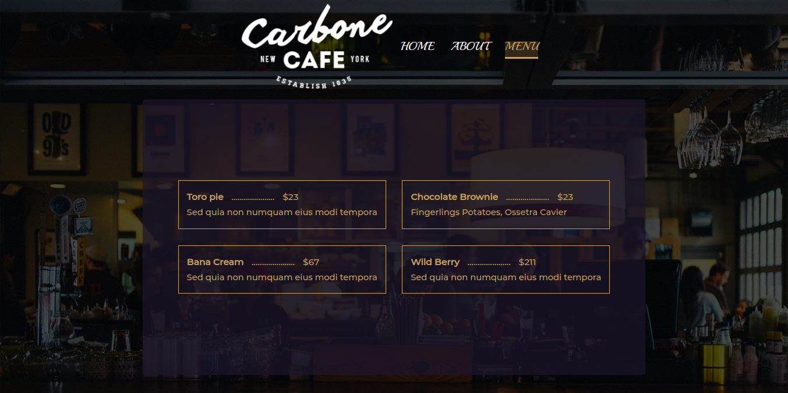
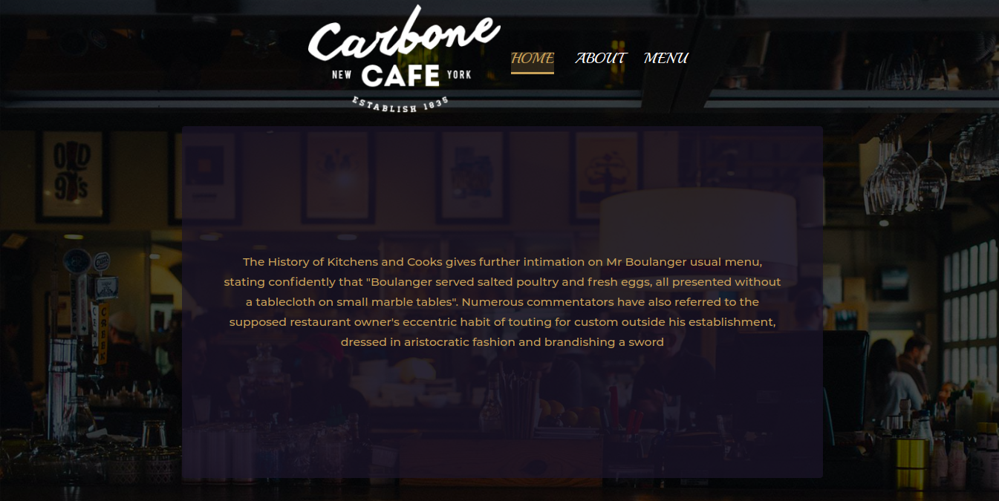
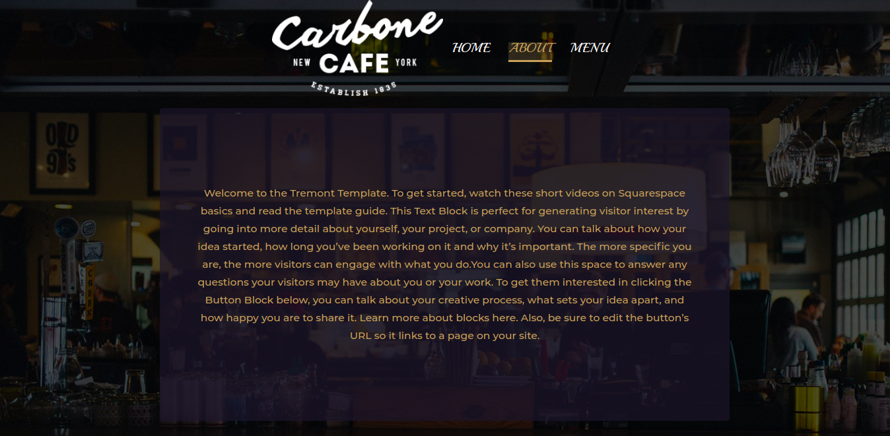

[![Contributors][contributors-shield]][contributors-url]
[![Forks][forks-shield]][forks-url]
[![Stargazers][stars-shield]][stars-url]
[![Issues][issues-shield]][issues-url]

<!-- PROJECT LOGO -->
<br />
<p align="center">
    

  <h3 align="center">A SIMPLE RESTAURANT APP </h3>

  <p align="center">
    A web App created in the fulfillment of Microverse mandatory Javascript restaurant project.
    <br />
    <a href="https://afritrend.herokuapp.com/users/sign_in">View Demo</a>
    ·
    <a href="https://github.com/Cyrus-Kiprop/afriTrend/issues">Report Bug</a>
    ·
    <a href="https://github.com/Cyrus-Kiprop/afriTrend/issues">Request Feature</a>
  </p>
</p>

<!-- TABLE OF CONTENTS -->

## Table of Contents

- [About the Project](#about-the-project)
  - [Live Demo](#live-demo)
  - [Built With](#built-with)
- [Getting Started](#getting-started)
  - [Prerequisites](#prerequisites)
  - [Installation](#installation)
- [Usage](#usage)
- [Roadmap](#roadmap)
- [Contributing](#contributing)
- [License](#license)
- [Contact](#contact)
- [Acknowledgements](#acknowledgements)

<!-- ABOUT THE PROJECT -->

## About The Project



The app is built using native javascript api for manipulating the DOM. The main aim of this app was to aquaint the learner with DOM manipulation skills using vanilla Javascript. The site constitutes of 3 tab sections, mainly:-

```sh
Home (Landing Page)
```

- This section contains a simple dummy description of the restaurant app.
- This is also the landing page.
  

```sh
About Section
```

- This section a dummy description of the restaurant app.
  

```sh
Menu Section.
```

- Constitutes dummy delicacies offered by the restaurant to it's customers.
  

```sh

```

## Live Demo

Click [ here ](https://raw.githack.com/Cyrus-Kiprop/restaurant_page/gh-pages/index.html) for a live demo of the app.

### Built With

The project was built using the following languages stacks:

```sh
Front-End(client)
```

- [Bootstrap v 4](https://getbootstrap.com)
- HTML
- JavaScript
- [Font Awesome Icons](https://fontawesome.com/icons?d=gallery)

```sh
Testing Frameworks
```

- N/A

<!-- GETTING STARTED -->

## Getting Started

To get a local copy up and running follow these simple example steps.

### Prerequisites

- Node

- Basic knowledge of npm/yarn

### Installation

1. Clone the repo

```sh
git clone https://github.com/Cyrus-Kiprop/restaurant_page
```

2. CD into the project root directory

```sh
cd ./restaurant_page
```

3. Install Dependencies and packages

```sh
npm install
```

4. Build the files

```sh
npm run build
```

<!-- USAGE EXAMPLES -->

## Usage

Open the index.html file using live servers.

```sh
right click on index.html file and open it with the browser or with live server.
```

### Navigate to your browser and open port 8080 (use your live server port):

```JS
http//localhost:8080
```

### Navigate and Enjoy

<!-- ROADMAP -->

## Roadmap

See the [open issues](https://github.com/Cyrus-Kiprop/restaurant_page/issues) for a list of proposed features (and known issues).

<!-- CONTRIBUTING -->

## Contributing

Contributions are what make the open source community such an amazing place to be learn, inspire, and create. Any contributions you make are **greatly appreciated**.

1. Fork the Project
2. Create your Feature Branch (`git checkout -b feature/NewAwesomeFeature`)
3. Commit your Changes (`git commit -m 'Add some NewAmazingFeature'`)
4. Push to the Branch (`git push origin feature/NewAmazingFeature`)
5. Open a Pull Request

<!-- CONTACT -->

## Contact

Cyrus Kiprop - cyruskiprop254@gmail.com

Project Link: [https://github.com/Cyrus-Kiprop/restaurant_page](https://github.com/Cyrus-Kiprop/restaurant_page)

## Authors

👤 **Cyrus Kiprop**

- Github: [Cyrus-Kiprop](https://github.com/Cyrus-Kiprop)
- Twitter: [@kipropJS](https://twitter.com/kipropJS)
- Linkedin: [Cyrus Kiprop](https://www.linkedin.com/in/cyrus-kiprop-ba7320120/)

## Acknowledgements

- [Font Awesome](https://fontawesome.com)
- [Best-README-Template](https://github.com/othneildrew/Best-README-Template)
- [PNG-SVG converter](https://image.online-convert.com/convert-to-svg)

<!-- LICENSE -->

## License

Distributed under the MIT License. See [ LICENSE ](https://github.com/Cyrus-Kiprop/restaurant_page/blob/master/LICENSE) for more information.

<!-- MARKDOWN LINKS & IMAGES -->

[contributors-shield]: https://img.shields.io/github/contributors/Cyrus-Kiprop/restaurant_page.svg?style=flat-square
[contributors-url]: https://github.com/Cyrus-Kiprop/restaurant_page/graphs/contributors
[forks-shield]: https://img.shields.io/github/forks/Cyrus-Kiprop/restaurant_page.svg?style=flat-square
[forks-url]: https://github.com/Cyrus-Kiprop/restaurant_page/network/members
[stars-shield]: https://img.shields.io/github/stars/Cyrus-Kiprop/restaurant_page.svg?style=flat-square
[stars-url]: https://github.com/Cyrus-Kiprop/restaurant_page/stargazers
[issues-shield]: https://img.shields.io/github/issues/Cyrus-Kiprop/restaurant_page.svg?style=flat-square
[issues-url]: https://github.com/Cyrus-Kiprop/restaurant_page/issues
[product-screenshot]: /app/assets/images/screenshot.png
